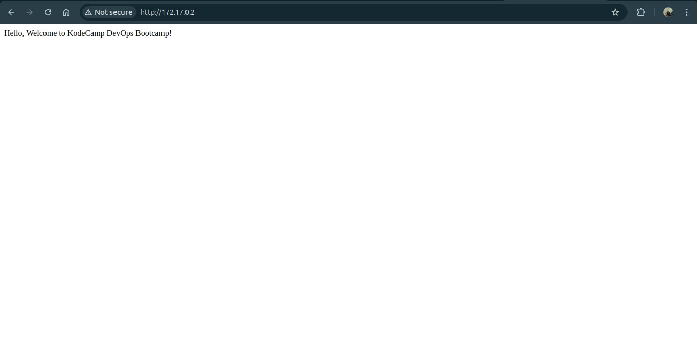
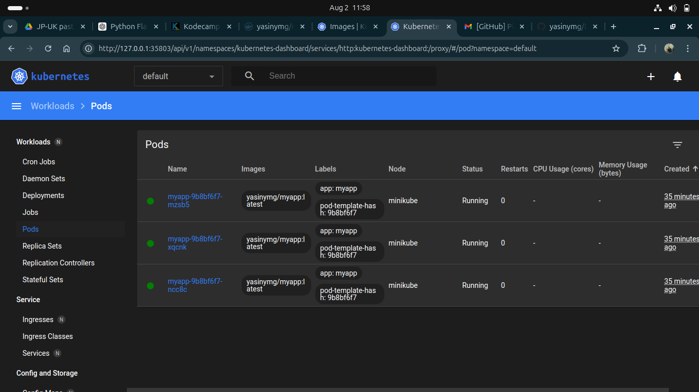
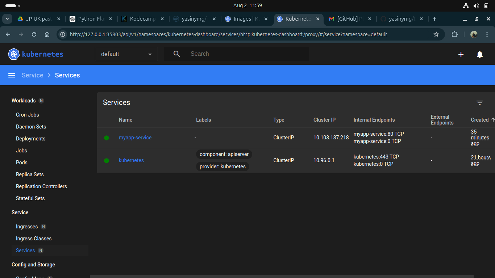

CREATING A DOCKERISED APPLICATION

## Description

This is a simple web application that displays the message "Hello, Welcome to kodecamp DevOps Bootcamp!". The application is built using Python and Flask, containerized using Docker, and deployed to a Kubernetes cluster.

## Steps

1. **Create the application:**
   - Created a Python Flask application that displays the message.

2. **Dockerize the application:**
   - Wrote a Dockerfile to containerize the application.
   - Built and ran the Docker image locally.
   - Tagged and pushed the Docker image to Docker Hub.

3. **Deploy to Kubernetes:**
   - Created Kubernetes manifest files for Deployment and Service.
   - Deployed the application to a Minikube cluster.
   - Port-forwarded the service and accessed the application in a web browser.

## Docker Image URL

[Docker Hub - myapp](https://hub.docker.com/r/yasinymg/myapp)

## Issues Encountered

- Issue 1: I had an issue with defining ports, i went through the docs and managed it.
  
- Issue 2: port fowarding was an issue too 
  

## Screenshots

- **Application Running:**
  

-**kubernetes Pods:**


-**kubernetes Services:**


```
 ##2. Dockerize the application:
- Write a Dockerfile to containerize the application.

```dockerfile
# Use the official Python image
FROM python:3.12-slim

# Set the working directory
WORKDIR /app

# Copy current directory contents into the container
COPY . /app

# Install dependencies
RUN pip install -r requirements.txt

# Make port 8000 available outside the container
EXPOSE 8000

# Run the app
CMD ["uvicorn", "main:app", "--host", "0.0.0.0", "--port", "8000"]
```


#### 3. Deploy the application to a Kubernetes cluster:
##### Create a Kubernetes manifest file for a Deployment to deploy the Docker image.

`Deployment.yaml`
```yaml
apiVersion: apps/v1
kind: Deployment
metadata:
  name: myapp-app
```
- apiVersion: Specifies the API version of the resource,
- kind: Defines the type of resource, which is a Deployment.
- metadata: Contains metadata about the deployment. Here, we have specified the name of the deployment and set the namespace to kodecamp-app.

```yaml
spec:
  replicas: 1
  selector:
    matchLabels:
      app: myapp
   -app
  template:
    metadata:
      labels:
        app: myapp
      -app
    spec:
      containers:
      - name: myapp
   -app
        image: yasinymg/myapp
      -app
        imagePullPolicy: Always
        ports:
        - containerPort: 8000
       

- spec: Describes the desired state of the deployment.
- replicas: Specifies the desired number of replicas (instances) of the application to run, which is 1 in this case.
- The selector and matchLabels fields specify labels that the deployment can identify the pods with.
- template: Defines a template for your pod. in this case, `myapp-app` is the label with which the pod should be identified.
- spec field under template describes the desired state of the pod, including the list of containers. In this case we have just one container, with the name `myapp-app`, and the image it should pull from my Docker Hub `gbedu/myapp-app`, and the port to which it is exposed. `imagePullPolicy` specifies the image pull policy. Here, I have used Always (always pull the latest image from the registry).
- resources: This section is used to specify the resource requests and limits for the containers in a pod. This helps Kubernetes manage resources efficiently and ensure that your application gets the resources it needs while preventing it from using too many resources. `Resource requests` are the `minimum` amount of resources that Kubernetes will allocate to the container. If the requested resources are not available, the pod will not be scheduled. `Resource limits` are the `maximum` amount of resources that the container can use. If the container tries to use more than the specified limits, Kubernetes will rescrict (throttle) it or, in the case of memory, potentially terminate the container.

## Create a Kubernetes Service of type ClusterIP to expose the application.
`Service.yaml`

```yaml
apiVersion: v1
kind: Service
metadata:
  name: myapp
-service
```
Similar to the deployment.yaml, the API version and metadata about the service with name myapp-service.
```yaml
spec:
  type: ClusterIP
  selector:
    app: myapp
   -app
  ports:
  - protocol: TCP
    port: 80
    targetPort: 8000
  ```

- Here, spec field describes the desired state of the Service which is of type Cluster IP.
- selector: Specifies the label that identifies with the pod the service should direct traffic to.
- ports: Specifies the list of ports that the service should expose.
- protocol: Specifies the type of protocol allowed.
- port: Specifies the port that the service listens on. External traffic will come to this port, while the targetPort specifies the port on the pods that the service should forward traffic to. In this case, the incoming traffic on the service's port 80 will be sent to the pods on port 8000.


## Bonus (Optional):
- Configure a ConfigMap to externalize the message "Hello, Kubernetes!".

`configmap.yaml`
```yaml
apiVersion: v1
kind: ConfigMap
metadata:
  name: myapp-config
data:
  MESSAGE: "Hello, Kubernetes!"
  ```
- update your application to read this message from the ConfigMap.

```python
import os
from fastapi import FastAPI

app = FastAPI()

@app.get("/")
def read_root():
    message = os.getenv('MESSAGE', 'Hello, Welcome to myapp
    DevOps Bookcamp!')
    return {"message": message}
```

- Create a Secret to store a sensitive piece of information.

`secret.yaml`
```yaml
apiVersion: v1
kind: Secret
metadata:
  name: myapp-secret
type: Opaque
data:
  PASSWORD: c2VjcmV0cGFzc3dvcmQ= # for practice
```

- update your application to use this Secret.
```python
import os
from fastapi import FastAPI

app = FastAPI()

@app.get("/")
def read_root():
    message = os.getenv('MESSAGE', 'Hello, Welcome to myapp
    DevOps Bookcamp!')
    password = os.getenv('PASSWORD', 'defaultpassword')
    return {"message": message, "password": password}
```

### Issues Encountered
I encountered issues in deploying the application to a Kubernetes cluster 
- Issue 1: 
`error: error validating "deployment.yaml": error validating data: failed to download openapi: Get "https://192.168.59.100:8443/openapi/v2?timeout=32s": net/http: TLS handshake timeout; if you choose to ignore these errors, turn validation off with --validate=false`
I got solution from [minikube troubleshooting](https://minikube.sigs.k8s.io/docs/handbook/troubleshooting/)

- Issue 2:
 `E0804 15:33:16.052721 6368 memcache.go:265] couldn't get current server API group list: Get "https://192.168.59.100:8443/api?timeout=32s": net/http: TLS handshake timeout`
 I solved it by resetting the kubernetes cluster to default setting

- Issue 3: Hung start-up
I solved with `minikube logs --problems`

